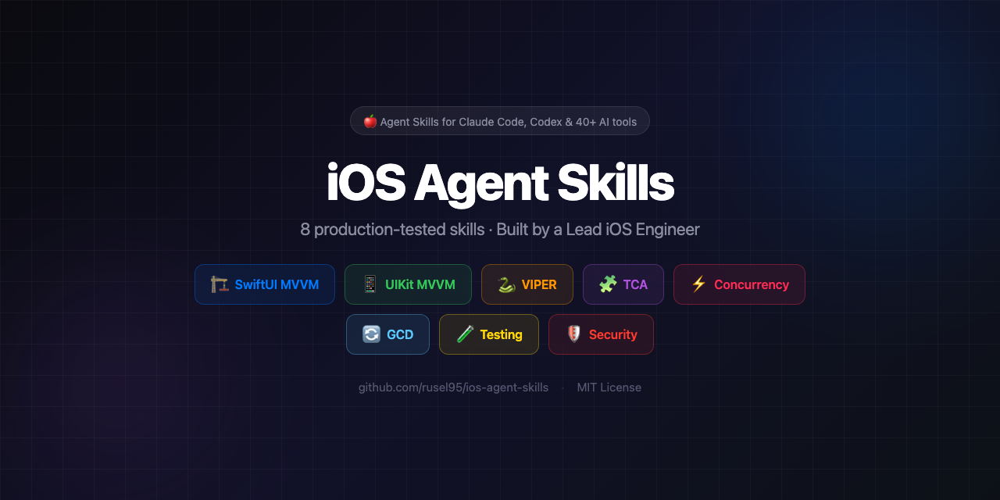

<p align="center">
  
</p>

<p align="center">
  <a href="https://github.com/rusel95/ios-agent-skills"></a>
  <a href="https://github.com/rusel95/ios-agent-skills"></a>
  <a href="https://github.com/rusel95/ios-agent-skills"></a>
  
  
  
  
  <a href="LICENSE"></a>
</p>

<p align="center">
  
  
  
  
</p>

<p align="center">
  
  
  
  
  
  
</p>

# iOS Agent Skills

**The first and most comprehensively benchmarked iOS skill marketplace** for Claude Code, Codex, and 40+ AI coding tools.

10 enterprise-grade skills covering architecture, concurrency, testing, security, accessibility, and localization — every skill benchmarked with discriminating assertions and blind A/B quality scoring across multiple LLMs. No other iOS skill collection has this level of rigorous, reproducible evaluation — 800 assertions across 245 scenarios, tested on Claude Sonnet 4.6, GPT-5.4, and Gemini 3.1 Pro.

## Benchmark Results

Every skill is benchmarked against multiple LLMs with discriminating assertions and blind A/B quality scoring.

| Skill | Sonnet 4.6 Delta | GPT-5.4 Delta | Gemini 3.1 Pro Delta | Scenarios | Assertions |
|-------|:-:|:-:|:-:|:-:|:-:|
| **swiftui-mvvm** | +11.1% | +40.8% | +76.0% | 23 | 63 |
| **uikit-mvvm** | +13.7% | +40.8% | +54.9% | 24 | 51 |
| **viper-uikit** | +13.4% | — | — | 16 | 149 |
| **tca-swiftui** | +25.9% | — | — | 20 | 113 |
| **swift-concurrency** | +32.5% | +17.8% | +35.6% | 21 | 40 |
| **gcd-operations** | +47.4% | +4.8% | +16.1% | 13 | 19 |
| **ios-testing** | +44.2% | +30.0% | +33.6% | 27 | 77 |
| **ios-security** | +29.7% | +26.4% | — | 17 | 37 |
| **ios-logging** | +34.1% | — | — | 27 | 91 |
| **ios-accessibility** | +18.3% | — | — | 36 | 115 |
| **ios-localization** | +1.9% | — | — | 36 | 103 |

> Delta = percentage point improvement in discriminating assertion pass rate (with skill vs without skill). Higher = more value added. "—" = not yet benchmarked for that model.

### Blind A/B Quality Scoring (Sonnet 4.6)

| Skill | W/T/L | Avg Score (with↑without) |
|-------|:-----:|:------------------------:|
| **swiftui-mvvm** | **9W** 15T 0L | 9.2↑8.8 |
| **uikit-mvvm** | **20W** 2T 2L | 9.1↑8.2 |
| **viper-uikit** | **15W** 1T 0L | 9.4↑8.2 |
| **tca-swiftui** | **14W** 2T 4L | 8.7↑7.8 |
| **swift-concurrency** | **15W** 9T 0L | 8.9↑8.5 |
| **gcd-operations** | **15W** 9T 0L | 8.6↑8.1 |
| **ios-testing** | **23W** 7T 0L | 8.9↑8.0 |
| **ios-security** | **9W** 15T 0L | 9.3↑8.9 |
| **ios-logging** | **25W** 0T 2L | 8.6↑7.4 |
| **ios-accessibility** | **21W** 15T 0L | 8.8↑7.9 |
| **ios-localization** | **27W** 0T 9L | 8.4↑7.6 |

> **W/T/L** — Blind A/B comparison: wins, ties, losses. A judge scores both responses 0-10 without knowing which used the skill; position is randomized. **Wins = skill response better. Ties = equally good. Losses = baseline better.**

### Methodology

- **Discriminating assertions**: binary checks that distinguish skill-guided output from baseline. Each assertion targets a specific pattern AI tools consistently miss without the skill.
- **A/B quality scoring**: blind judge scores both outputs 0–10 without knowing which used the skill. Position randomized to prevent bias.
- **Multi-model**: tested across Claude Sonnet 4.6, GPT-5.4, and Gemini 3.1 Pro to ensure skill value isn't model-specific.
- **Topic-based scenarios**: each skill covers all its domain topics with focused evaluation prompts.

## Skills

| Skill | Domain | iOS Target |
|-------|--------|------------|
| **swiftui-mvvm** | SwiftUI + @Observable MVVM | iOS 17+ |
| **uikit-mvvm** | UIKit + Combine MVVM | iOS 13+ |
| **viper-uikit** | VIPER Architecture | iOS 13+ |
| **tca-swiftui** | The Composable Architecture | iOS 16+ |
| **swift-concurrency** | async/await, Actors, Swift 6 | iOS 13+ |
| **gcd-operations** | GCD & OperationQueue | iOS 13+ |
| **ios-testing** | Testing across all architectures | iOS 13+ |
| **ios-security** | OWASP MASVS Security Audit | iOS 13+ |
| **ios-accessibility** | VoiceOver, Dynamic Type, WCAG 2.2 | iOS 13+ |
| **ios-logging** | Production Error Observability & Logging | iOS 15+ |
| **ios-localization** | String Catalogs, CLDR Plurals, RTL, Formatting | iOS 13+ |

## Install

### Claude Code Plugin (recommended)

```bash
claude plugin add rusel95/ios-agent-skills
```

Install individual skills:

```bash
claude plugin add rusel95/ios-agent-skills --skill swiftui-mvvm
claude plugin add rusel95/ios-agent-skills --skill swift-concurrency
```

### Agent Skills CLI

```bash
npx skills add rusel95/ios-agent-skills --skill swiftui-mvvm
```

### Manual

Clone and copy the `skills/` directory into your project.

## What Makes These Different

- **Production-first** — every pattern comes from real enterprise codebases, not tutorials
- **Iterative refactoring** — small, reviewable PRs (≤200 lines) instead of "rewrite everything" approaches
- **Anti-pattern prevention** — AI tools consistently generate broken patterns (retain cycles in VIPER, outdated TCA APIs, unsafe GCD). These skills prevent that
- **Architecture coverage** — the only collection covering VIPER, TCA, GCD, Security Audit, Accessibility, and Localization. No other iOS skill marketplace covers these domains
- **Rigorously benchmarked** — the most comprehensively evaluated iOS skill collection available: 800 discriminating assertions across 245 scenarios, tested against 3 LLMs with blind A/B quality scoring. Every skill ships with reproducible eval data

## Skill Details

### swiftui-mvvm
@Observable ViewModels, ViewState enum, Router navigation, constructor injection, Repository-based networking. Phased migration from ObservableObject. **+40.8% on GPT-5.4, +76.0% on Gemini.**

### uikit-mvvm
Combine-bound ViewModels, Coordinator navigation, DiffableDataSource, programmatic Auto Layout. GCD-to-Combine migration paths. **+40.8% on GPT-5.4, +54.9% on Gemini.**

### viper-uikit
Passive Views, single-use-case Interactors, UIKit-free Presenters, protocol-isolated module boundaries. Prevents the retain cycles AI tools consistently generate. **+13.4% on Sonnet 4.6** (149 assertions).

### tca-swiftui
@Reducer macro, @ObservableState, Effect API, @DependencyClient. Prevents outdated pre-1.7 TCA patterns (WithViewStore, Environment, IfLetStore). **+25.9% on Sonnet 4.6** (113 assertions).

### swift-concurrency
async/await, actor isolation, Sendable, TaskGroup, AsyncStream. Swift 6.2 readiness, strict concurrency migration, crash pattern prevention. **+32.5% on Sonnet, +35.6% on Gemini.**

### gcd-operations
DispatchQueue, OperationQueue, locks, barriers, DispatchSource. Thread explosion prevention, deadlock diagnosis, GCD-to-Swift-Concurrency migration. **+47.4% on Sonnet 4.6.**

### ios-testing
Swift Testing (@Test/@Suite/#expect), XCTest, async testing, architecture-specific patterns (MVVM/VIPER/TCA), snapshot testing, integration testing. **+44.2% on Sonnet, +30% on GPT-5.4.**

### ios-security
OWASP MASVS v2.1.0 audit (24 controls, 8 categories). Keychain, ATS, certificate pinning, WebView, biometric auth, compliance mapping (HIPAA, PCI DSS, GDPR). **+29.7% on Sonnet, +26.4% on GPT-5.4.**

### ios-logging
Production error observability: `os.Logger` with privacy annotations, crash SDK integration (Sentry/Crashlytics), MetricKit for OOM/watchdog detection, silent failure pattern elimination (`try?`, `Task {}`, Combine `.replaceError()`), PII compliance, centralized error handling, retry with backoff, app extension monitoring, MCP connectivity for AI-assisted debugging. **25W 0T 2L** blind A/B (8.6↑7.4), **+34.1% on Sonnet 4.6** (91 assertions, 27 scenarios).

### ios-accessibility
VoiceOver, Dynamic Type, color contrast, motion preferences, Switch Control, Voice Control, WCAG 2.2 AA mapping. Corrects 11 documented AI failure patterns (onTapGesture, hardcoded fonts, missing labels, trait assignment). **+18.3% on Sonnet 4.6** (115 assertions, 100% with-skill, 21 discriminating wins).

### ios-localization
String Catalogs (.xcstrings), CLDR pluralization (Russian, Polish, Arabic), SwiftUI/UIKit localization APIs, date/number/currency formatting, RTL layout, accessibility localization, enterprise patterns (modular apps, white-label). Corrects 30 documented AI localization failures. Includes Python scripts for .xcstrings validation and plural auditing. **+1.9% on Sonnet 4.6** (103 assertions; 27W 0L 9T A/B — skill value is in depth and edge cases, not core knowledge gaps).

## Author

**Ruslan Popesku** — Lead iOS Software Engineer at EPAM
[GitHub](https://github.com/rusel95) · [LinkedIn](https://www.linkedin.com/in/rusel95)

## License

MIT
