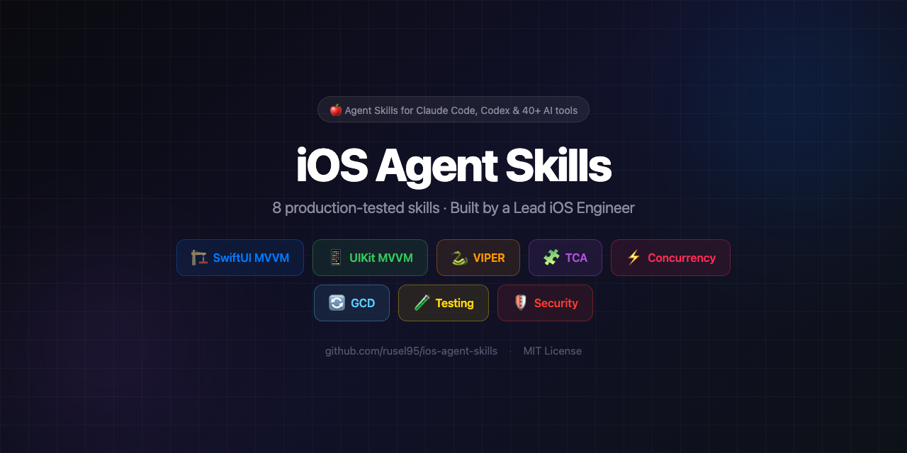

<p align="center">
  
</p>

<p align="center">
  <a href="https://github.com/rusel95/ios-agent-skills"></a>
  <a href="https://github.com/rusel95/ios-agent-skills"></a>
  
  
  
  
  <a href="LICENSE"></a>
  <a href="https://lobehub.com/skills?q=rusel95-ios-agent-skills"></a>
</p>

# iOS Agent Skills

**The first and most comprehensively benchmarked iOS skill marketplace** for Claude Code, Codex, and 40+ AI coding tools.

11 enterprise-grade skills covering architecture, concurrency, testing, security, accessibility, and localization — every skill benchmarked with discriminating assertions and blind A/B quality scoring across multiple LLMs. No other iOS skill collection has this level of rigorous, reproducible evaluation — 850+ assertions across 260+ scenarios, tested on Claude Sonnet 4.6, GPT-5.4, and Gemini 3.1 Pro.

## Benchmark Results

Every skill is benchmarked against multiple LLMs with discriminating assertions and blind A/B quality scoring.

| Skill | Sonnet 4.6 | GPT-5.4 | Gemini 3.1 Pro |
|-------|:-:|:-:|:-:|
| [**swiftui-mvvm**](skills/swiftui-mvvm) |  · 9W 15T 0L (9.2↑8.8) |  · 5W 17T 1L |  · 21W 0T 0L (9.1↑6.2) |
| [**uikit-mvvm**](skills/uikit-mvvm) |  · 20W 2T 2L (9.1↑8.2) |  · 24W 0T 0L (9.0↑7.4) |  · 24W 0T 0L (9.2↑5.7) |
| [**gcd-operations**](skills/gcd-operations) |  · 15W 9T 0L (8.6↑8.1) |  · 18W 1T 5L (8.6↑7.8) |  · 12W 0T 1L (8.8↑7.1) |
| [**ios-testing**](skills/ios-testing) |  · 23W 7T 0L (8.9↑8.0) |  · 6W 21T 0L |  · 27W 0T 0L (9.2↑6.5) |
| [**swift-concurrency**](skills/swift-concurrency) |  · 15W 9T 0L (8.9↑8.5) |  · 21W 0T 0L (9.0↑7.6) |  · 21W 0T 0L (9.2↑7.3) |
| [**ios-security**](skills/ios-security) |  · 9W 15T 0L (9.3↑8.9) |  · 2W 15T 0L |  · 10W 0T 0L (9.1↑6.0) |
| [**tca-swiftui**](skills/tca-swiftui) |  · 14W 2T 4L (8.7↑7.8) | — | — |
| [**viper-uikit**](skills/viper-uikit) |  · 15W 1T 0L (9.5↑9.4) |  · 16W 0T 0L (9.0↑7.3) |  · 16W 0T 0L (7.3↑1.7) |
| [**ios-logging**](skills/ios-logging) |  · 23W 3T 1L (9.0↑8.5) |  · 23W 0T 4L (8.8↑8.2) |  · 24W 0T 0L (9.2↑6.3) |
| [**ios-accessibility**](skills/ios-accessibility) |  · 27W 5T 4L (8.5↑7.9) |  · 31W 1T 4L (9.2↑8.5) |  · 36W 0T 0L (9.0↑7.2) |
| [**ios-localization**](skills/ios-localization) |  · 10W 21T 5L (8.9↑8.7) |  · 26W 2T 8L (9.1↑8.9) |  · 36W 0T 0L (9.0↑6.3) |

> Each cell: assertion delta (with skill vs without) · A/B blind comparison W/T/L with avg scores where available. Colored badge = best result for that skill. "—" = not yet benchmarked.

See [BENCHMARKING.md](BENCHMARKING.md) for full methodology.

## Install

### Claude Code Plugin (recommended)

```bash
claude plugin add rusel95/ios-agent-skills
```

Install individual skills:

```bash
claude plugin add rusel95/ios-agent-skills --skill swiftui-mvvm
claude plugin add rusel95/ios-agent-skills --skill swift-concurrency
```

### Agent Skills CLI

```bash
npx skills add rusel95/ios-agent-skills --skill swiftui-mvvm
```

### Manual

Clone and copy the `skills/` directory into your project.

## What Makes These Different

- **Production-first** — every pattern comes from real enterprise codebases, not tutorials
- **Iterative refactoring** — small, reviewable PRs (≤200 lines) instead of "rewrite everything" approaches
- **Anti-pattern prevention** — AI tools consistently generate broken patterns (retain cycles in VIPER, outdated TCA APIs, unsafe GCD). These skills prevent that
- **Architecture coverage** — the only collection covering VIPER, TCA, GCD, Security Audit, Accessibility, and Localization. No other iOS skill marketplace covers these domains
- **Rigorously benchmarked** — the most comprehensively evaluated iOS skill collection available: 850+ discriminating assertions across 260+ scenarios, tested against 3 LLMs with blind A/B quality scoring. Every skill ships with reproducible eval data

## Author

**Ruslan Popesku** — Lead iOS Software Engineer
[GitHub](https://github.com/rusel95) · [LinkedIn](https://www.linkedin.com/in/rusel95)

## License

MIT
